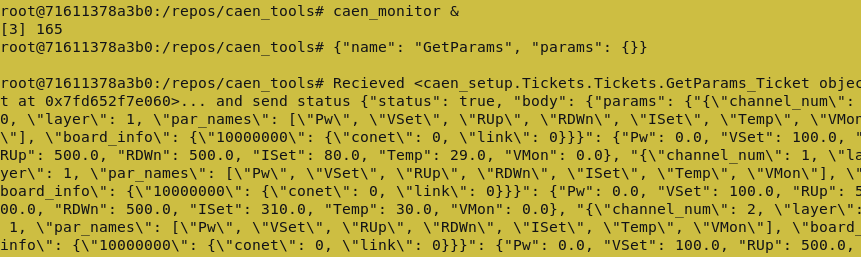
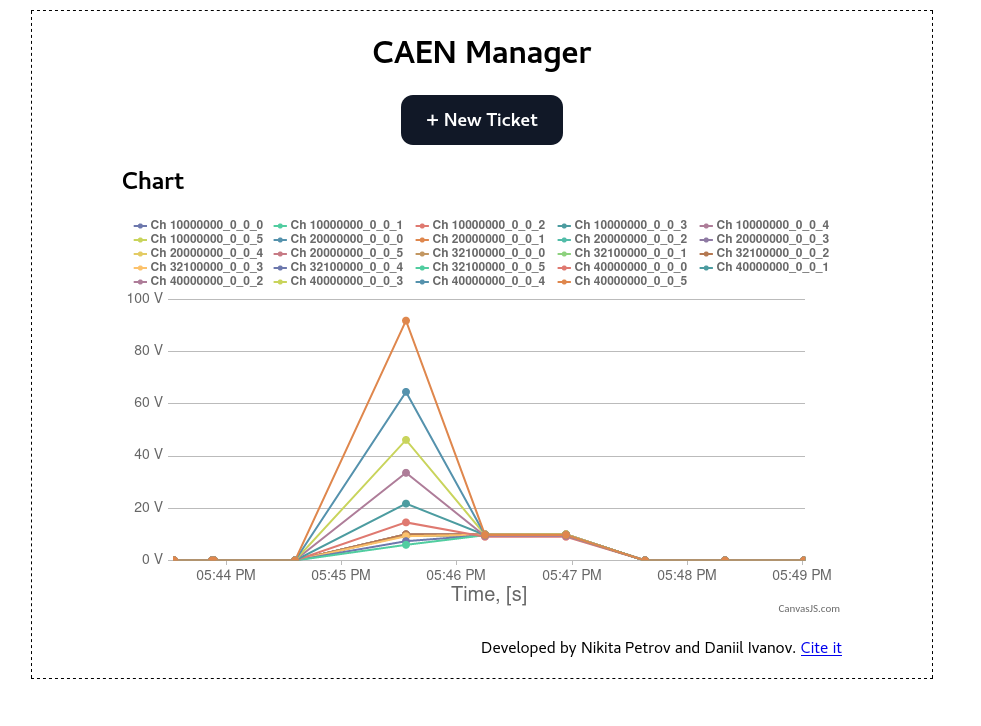

# Запуск управления CAEN в режиме разработки
Здесь находится пошаговая инструкция по запуску программы, управляющей CAEN'ом, в режиме разработки (т.е. программа ещё с возможными проблемами; сервисы запускаются внутри одного контейнера, а не распределены; и т.п.).

## Иструкция по запуску
* Заходим на `dq11cmd` (нужно быть либо `root`-пользователем, либо админом, т.к. дальше оттуда будем запускать докер с правами администратора)
```bash
ssh dq11cmd
```
* Переходим в рабочую директорию `/setups/caen/`
```bash
cd /setups/caen/
```
* Запускаем docker-контейнер `caen_device_docker` в интерактивном режиме с возможностью работы со внешними устройствами 
  * пояснение: `-it` (интерактивный режим) `--privileged` (открыть доступ к устройствам) `--rm` (удалить образ после закрытия) `-v` (примонтировать директорию к образу) `-p` (открыть порты)
```bash
sudo docker run -it --privileged --rm -v ./repos:/repos -p 8000:8000 caen_device_docker
```
* Теперь мы оказались внутри контейнера, работаем дальше
* Переходим к пакету `caen_tools`
```bash
cd /repos/caen_tools
```
* Устанавливаем пакет в режиме разработки (с дополнительными зависимостями для веб-сервиса)
```bash
pip install -e .[webservice]
```
* Подготовка завершена. Теперь запускаем скрипты по очереди
```bash
caen_device_backend &
caen_proxy &
caen_monitor &
```
* После запуска монитора начнёт появляться много текста в выводе, всё нормально, это идёт запись монитора в базу данных (по умолчанию `monitor.db`)

* Запускаем веб-сервер командой
```bash
uvicorn caen_tools.WebService.ws:app --host 0.0.0.0
```
* Переходим в браузере по ссылке [http://dq11cmd:8000](http://dq11cmd:8000). Должны увидеть похожую страницу. 

Это и есть управление источником CAEN. Отправить задачу можно нажатием на кнопку `New Ticket`. В разделе `Chart` показана зависимость напряжения на каналах CAEN от времени (изначально диапазон 10 минут)

## Troubleshooting

### `dq11cmd` не реагирует
1. перезагрузить dq11cmd
1. запустить демон докера `sudo systemctl start docker`
1. переустановить драйвер взаимодействия с **A3818**
  ```bash
  cd /setups/caen/soft/A3818Drv-1.6.8/
  make
  sudo make install 
  ```