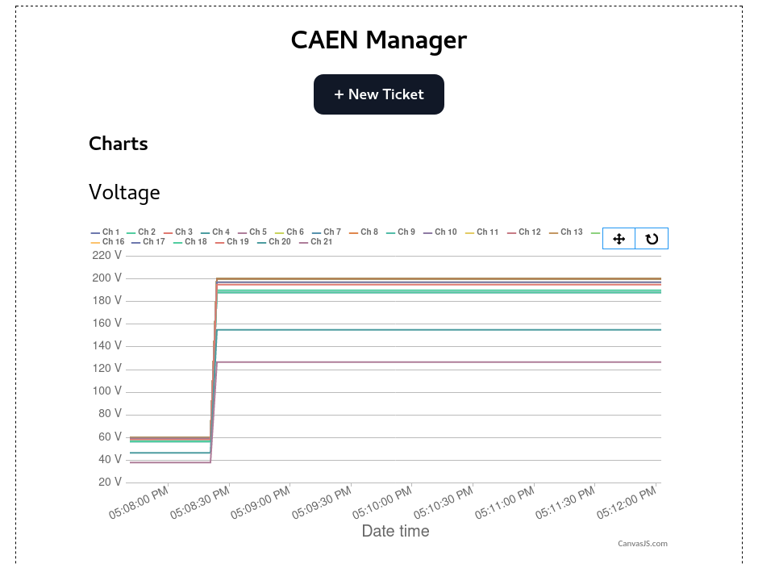

# Запуск управления CAEN

Здесь находится пошаговая инструкция по запуску приложения для управления CAEN'ом.

## Иструкция по запуску
* Заходим на `dq11cmd` (нужно быть либо `root`-пользователем, либо админом, т.к. дальше оттуда будем запускать докер с правами администратора)
```bash
ssh dq11cmd
```
* Переходим в рабочую директорию `/setups/caen/`
```bash
cd /setups/caen/
```
* Скачиваем файлы из директории [*dq11/*](../dq11/)
и запускаем `docker compose` по инструкции из [README](../dq11/README.md)

* Переходим в браузере по ссылке [http://dq11cmd:8000](http://dq11cmd:8000). Должны увидеть похожую страницу. 

Это и есть управление источником CAEN. Отправить задачу можно нажатием на кнопку `New Ticket`. В разделе `Charts` показана зависимость напряжения и силы тока на каналах CAEN от времени (диапазон 15 минут, обновление ежесекундно)

## Troubleshooting

### `dq11cmd` не реагирует
1. перезагрузить dq11cmd
1. запустить демон докера `sudo systemctl start docker`
1. переустановить драйвер взаимодействия с **A3818**
  ```bash
  cd /setups/caen/soft/A3818Drv-1.6.8/
  make
  sudo make install 
  ```